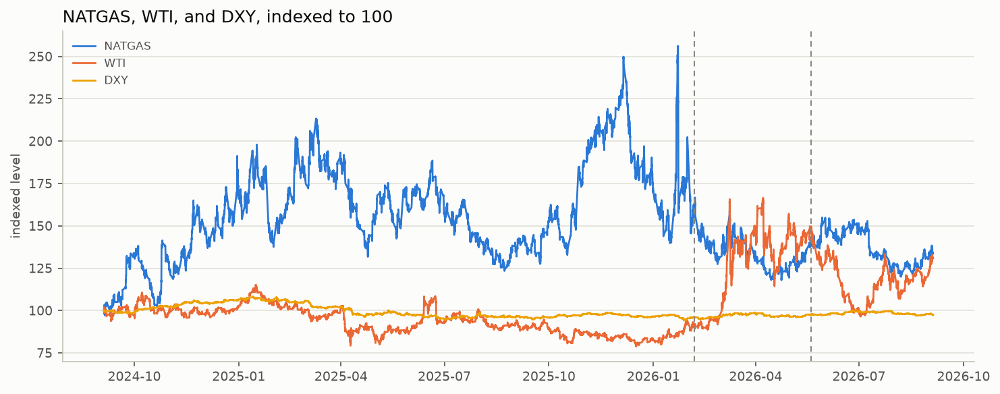
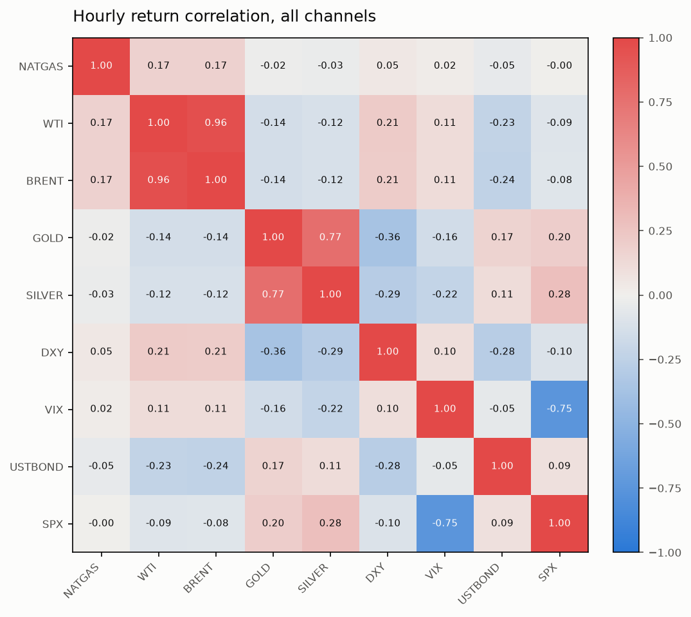
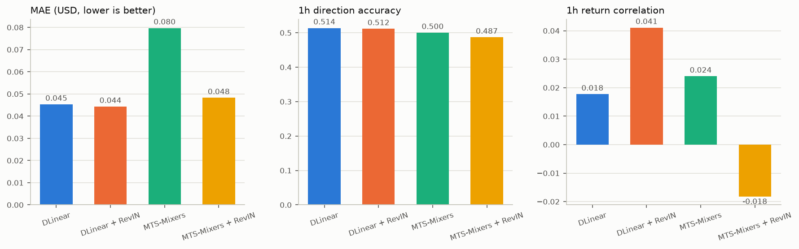
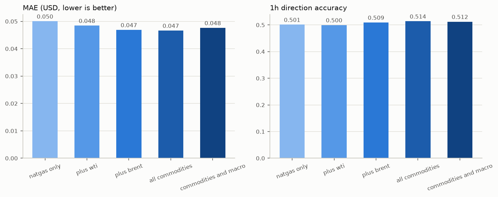
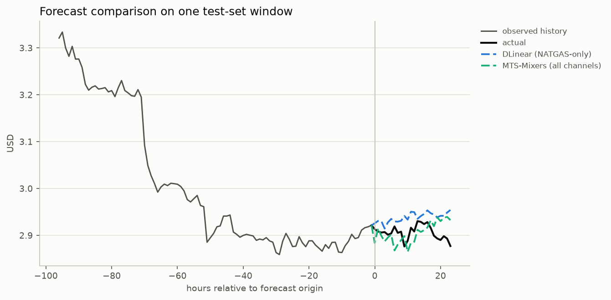

# MTS-Mixers: does cross-market data help forecast NATGAS?

A from-scratch PyTorch implementation of **MTS-Mixers** (Li et al., arXiv:2302.04501) -
factorized temporal mixing and low-rank channel mixing in place of Transformer attention -
tested against a disciplined channel-ablation ladder: does adding WTI, Brent, gold, silver,
DXY, VIX, a bond CFD, and the S&P 500 actually improve out-of-sample NATGAS forecasts, or does
it just add noise? All data is real, hourly, pulled from Dukascopy.

This is the companion repo to [`fan-natgas-forecasting`](https://github.com/jsawyerdev/fan-natgas-forecasting),
which asked a different question (does frequency-domain normalization help) and got a mostly
negative answer. This repo's answer is more mixed: cross-market information helps a little, up
to a point, through one specific channel set -- and adding more past that point makes it worse.

## The idea

Most work comparing DLinear against Transformer-style forecasters treats "temporal dependence"
and "cross-variable dependence" as one problem an attention stack should solve jointly.
MTS-Mixers' argument: separate them.

- **Temporal mixing** asks "how do timestamps in *one* series relate to each other" --
  handled by interleaving the L-length window into `stride` subsequences (`1 2 3 4 5 6 7 8`
  with stride 2 becomes `1 3 5 7` / `2 4 6 8`, not a contiguous split -- neighbouring hourly
  bars are redundant, so interleaving spreads each subsequence across the whole window), mixing
  each with one shared MLP, then merging back in order.
- **Channel mixing** asks "how do variables relate to each other" -- handled by a low-rank
  bottleneck (project C channels down to a smaller rank, mix, project back up), on the
  observation that correlated markets (WTI/Brent, gold/silver) carry overlapping information
  rather than being fully independent sources.

```
                96h x 9 channels
                       |
                       v
              +-----------------+
              | temporal mixing |   interleaved-subsequence MLP, per channel
              +-----------------+
                       |
              +-----------------+
              | channel mixing  |   low-rank C -> r -> C bottleneck, per timestep
              +-----------------+
                       |
                    (repeat x2)
                       |
                       v
         per-channel Linear(96 -> 24) head
                       |
                       v
              next 24h, all 9 channels
                (only NATGAS is scored)
```

This repo's `MTSMixers` class is a **from-scratch reimplementation of the paper's two central
ideas**, not a port of the [official repo](https://github.com/plumprc/MTS-Mixers) -- the exact
factorization scheme and channel-compression mechanism are simplified. See
[Implementation notes](#implementation-notes).

## The data: NATGAS + 8 cross-market channels, all from Dukascopy

Every channel comes from the same provider used throughout, rather than mixing in a second API
for a couple of extra series:

| channel | Dukascopy instrument | stands in for |
|---|---|---|
| `natgas` | `GAS.CMD/USD` | forecast target |
| `wti`, `brent` | `E_Light`, `E_Brent` | oil complex |
| `gold`, `silver` | `XAU/USD`, `XAG/USD` | metals |
| `dxy` | `DOLLAR.IDX/USD` | dollar index |
| `vix` | `VOL.IDX/USD` | volatility gauge |
| `ustbond` | `USTBOND.TR/USD` | a rates channel -- a bond CFD, not literally a 10Y yield |
| `spx` | `E_SandP-500` | equity risk |

No weather or storage-report data: Dukascopy doesn't carry it, and pulling it in would mean a
second provider and API keys for two channels, which stretches this past "one clean demo repo."
That's a real scope limitation, not an oversight -- see [Residual risk](#residual-risk-and-scope).

Every channel keeps its own trading calendar; [`data.py`](mts_mixers_natgas/data.py) inner-joins
on timestamp rather than forward-filling, so only hours where all nine channels printed a close
survive (11,822 raw NATGAS candles -> 9,805 aligned rows). Chronological 70/15/15 split, and
every scaler is fit on the train split only -- the same discipline as the FAN companion repo,
for the same reason.



## What's actually correlated with NATGAS

Before trusting a channel-mixing model to find cross-market structure, it's worth checking
whether any exists. Hourly return correlation, all nine channels, test-split-excluded:



WTI and Brent correlate at 0.96 with each other (same fundamental, expected), gold and silver at
0.77, VIX and the S&P 500 at -0.75 (textbook risk-off). NATGAS correlates weakly with
*everything*: 0.17 with WTI and Brent, effectively zero with gold, silver, DXY, VIX, the bond
CFD, and the S&P 500. That's the central fact this whole experiment runs into -- there isn't
much genuine cross-market linear structure at the hourly level for a channel-mixing model to
extract from most of these channels, WTI/Brent aside.

## Results: the four-way baseline

DLinear only ever sees NATGAS -- its per-channel heads never mix across channels, so feeding it
the other eight would change nothing about its NATGAS forecast while wasting compute. MTS-Mixers
sees all nine, since testing its channel-mixing block on the full set is the point.

| run | MAE | MSE | 1h dir. acc. | 1h return corr. | PnL after costs (bps) |
|---|---|---|---|---|---|
| DLinear | 0.0453 | 0.00388 | 0.514 | 0.018 | -3.35 |
| DLinear + RevIN | **0.0443** | **0.00370** | 0.512 | 0.041 | -2.32 |
| MTS-Mixers | 0.0797 | 0.00938 | 0.500 | 0.024 | -4.46 |
| MTS-Mixers + RevIN | 0.0483 | 0.00423 | 0.487 | -0.018 | -5.81 |



DLinear + RevIN is the strongest of the four on MAE, MSE, and PnL. MTS-Mixers without RevIN is
the weakest by a wide margin -- training one model to jointly reconstruct nine raw-but-scaled
channels is a harder optimization problem than fitting a linear model to one, and it shows.
RevIN closes most of that gap (0.0797 -> 0.0483 MAE) but MTS-Mixers still doesn't beat the
simple NATGAS-only baseline here. Whichever of the two MTS-Mixers configurations has the lower
validation MSE (RevIN, on this run) is the one the channel-ablation ladder below uses throughout.

## Results: the channel-ablation ladder

The more informative test: does *widening* the channel set given to MTS-Mixers actually improve
NATGAS forecasts out-of-sample, or does it just add noise? Five MTS-Mixers + RevIN runs, same
seed, same everything except which columns are in the input:

| ladder step | channels | MAE | 1h dir. acc. | 1h return corr. |
|---|---|---|---|---|
| A: NATGAS only | natgas | 0.0500 | 0.501 | 0.060 |
| B: + WTI | +wti | 0.0484 | 0.500 | 0.009 |
| C: + Brent | +brent | 0.0469 | 0.509 | 0.067 |
| D: + all commodities | +gold, silver | **0.0466** | **0.514** | **0.098** |
| E: + macro | +dxy, vix, ustbond, spx | 0.0476 | 0.512 | 0.012 |



Not monotonic, and that's the finding. MAE improves fairly steadily from A to D as the
commodity complex is added (0.0500 -> 0.0466), and correlation nearly doubles (0.060 -> 0.098).
Adding the four macro channels at step E makes it *worse* on every metric than D -- MAE ticks up
and correlation collapses back to 0.012, in line with the correlation heatmap showing those four
channels carry close to nothing linearly related to NATGAS. Step B (+WTI alone) is also worse
than A on correlation despite WTI being NATGAS's most correlated channel, which is a useful
caution on its own: a channel that's correlated with the target isn't automatically a channel
that helps a joint model trained on aggregate loss actually use that correlation well.

Put plainly: D (all commodities) is the best point on this ladder, and it's a real improvement
over MTS-Mixers seeing NATGAS alone. It is **not** a clear improvement over the much simpler
DLinear + RevIN NATGAS-only baseline (MAE 0.0466 vs. 0.0443) -- direction accuracy is
essentially tied (0.514 vs. 0.512) and correlation is higher for D (0.098 vs. 0.041), but MAE
and MSE both still favor the simple baseline. On this data, at this horizon, with this training
budget: cross-market information is not obviously worth the added model complexity, though it
isn't obviously worthless either. That's a weaker and more honest conclusion than either "it
works" or "it doesn't," and it's the conclusion the data supports.

One test-set window, DLinear (NATGAS-only) against the widest ladder point:



## Running it

```bash
uv sync --extra dev
uv run mts-mixers-experiment
```

Fetches ~2 years of nine hourly channels (cached after the first run), runs the four-way
baseline comparison, runs the five-rung channel ladder, prints both comparison tables, writes
`outputs/results.json` (including per-volatility-regime and per-direction breakdowns), and
regenerates every figure in `docs/figures/`. Flags of note: `--seq-len` / `--pred-len` (default
96 / 24), `--mixer-stride` / `--mixer-channel-rank` / `--mixer-num-blocks` (default 2 / 4 / 2),
`--epochs`, `--spread-bps` / `--slippage-bps`.

```bash
uv run pytest
uv run ruff check . && uv run black --check . && uv run mypy mts_mixers_natgas
```

## Implementation notes

- **Interleaved factorization, not contiguous chunking**
  ([`mixer.py`](mts_mixers_natgas/mixer.py)): `TemporalMixing` reshapes `(B, L, C)` to
  `(B, L/stride, stride, C)` -- element `t = i*stride + k` lands at `[i, k]`, so slicing axis 2
  at `k` recovers exactly `x[:, k::stride, :]`, the k-th subsequence, with no gather/scatter
  needed. Verified in `tests/test_mixer.py` by swapping the MLP for an identity and checking the
  reshape-permute-merge round trip reconstructs the input exactly.
- **Low-rank channel mixing**: a plain `Linear(C, r)` -> GELU -> `Linear(r, C)` bottleneck,
  applied identically at every timestep, with `r` = 4 by default for 9 channels.
- **Training objective vs. evaluation metric, and why that matters here**: every MTS-Mixers run
  is trained to reconstruct *all* channels it's given (standard multivariate MSE), then
  `evaluate.py` slices out NATGAS alone for every reported metric. Early stopping picks the
  checkpoint with the best *aggregate* validation loss across every channel the model saw, not
  the best NATGAS-specific one -- a real mismatch between the model-selection criterion and what
  actually gets scored, and a plausible contributor to MTS-Mixers' weaker baseline showing versus
  the always-NATGAS-only DLinear. A per-target early-stopping criterion is the natural next
  experiment, not implemented here.
- **DLinear and RevIN** are unchanged from the FAN companion repo (same files, copied rather than
  imported across two independent repos): DLinear per Zeng et al. (AAAI 2023), RevIN per Kim et
  al. (ICLR 2021).

## Residual risk and scope

- Single seed, no hyperparameter search over `stride` / `channel_rank` / `num_blocks` /
  learning rate for either backbone. The baseline and ladder comparisons could shift with tuning
  that wasn't attempted here.
- PnL figures are illustrative only -- see the `evaluate.py` docstring; no position sizing,
  funding, or execution-latency modeling.
- No weather or storage-report channels (see [The data](#the-data-natgas--8-cross-market-channels-all-from-dukascopy)).
- `ustbond`/`vix`/`dxy` are Dukascopy CFD proxies, not the literal instruments they stand in for
  (a US 10Y yield series, the CBOE VIX index, the ICE Dollar Index) -- close enough to test the
  hypothesis, not interchangeable with the real series for anything more exacting.

## References

- Li, Z. et al., "MTS-Mixers: Multivariate Time Series Forecasting via Factorized Temporal and
  Channel Mixing," arXiv:2302.04501. [Paper](https://arxiv.org/abs/2302.04501) -
  [official repo](https://github.com/plumprc/MTS-Mixers)
- Zeng, A. et al., "Are Transformers Effective for Time Series Forecasting?," AAAI 2023
  (DLinear).
- Kim, T. et al., "Reversible Instance Normalization for Accurate Time-Series Forecasting
  against Distribution Shift," ICLR 2021 (RevIN).
- [`dukascopy-python`](https://pypi.org/project/dukascopy-python/) for every data channel.
- Companion repo: [`fan-natgas-forecasting`](https://github.com/jsawyerdev/fan-natgas-forecasting).

## License

MIT - see [LICENSE](LICENSE).
